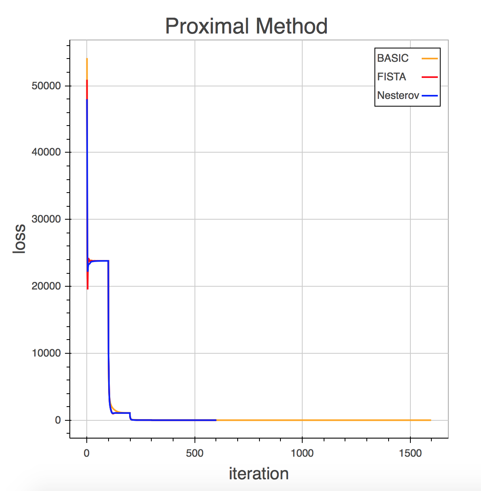
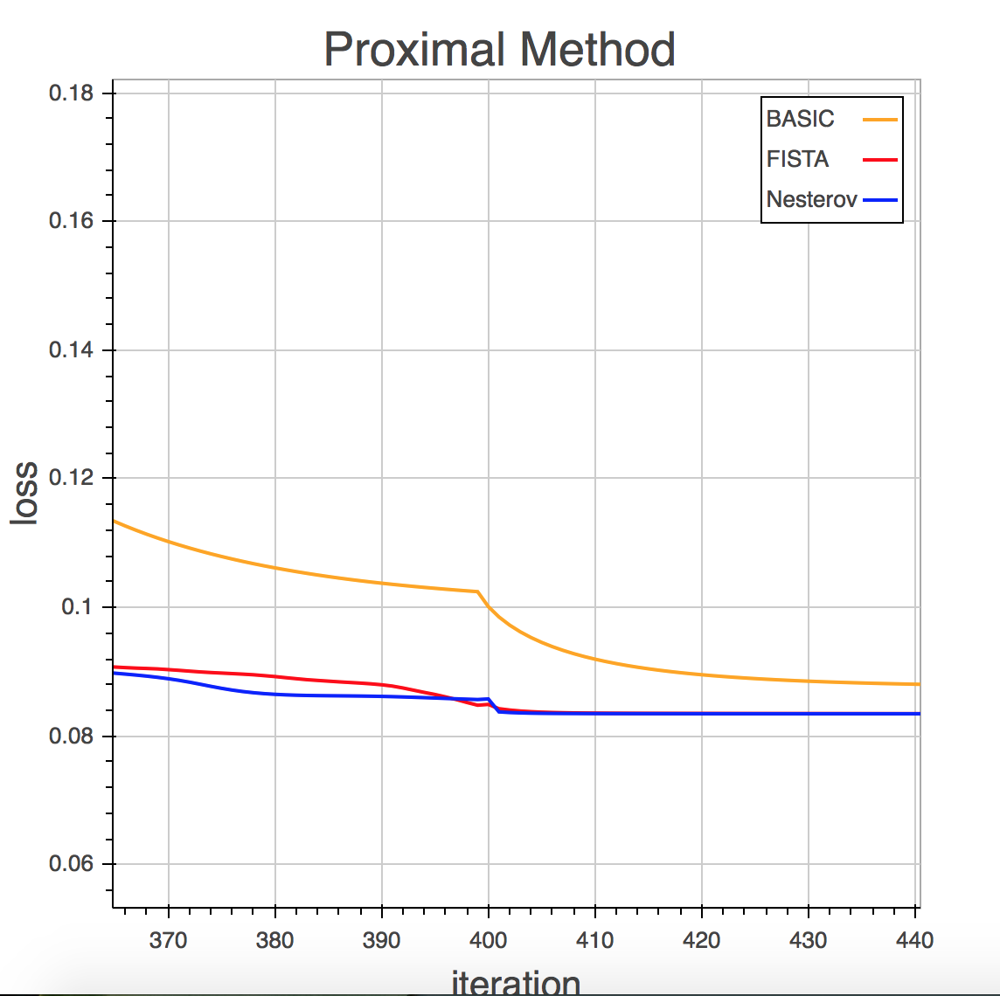

# convex_optimization
This is a homework which implements almost all solutions of LASSO, such as cvxpy, gurobi, mosek, gradient descent, proximal primal problem, smoothed primal problem, FISTA, Nesterov second and so on. Currently I completed the Chinese 'README', but in the near future, I will try to write an English version.

为了更好的利用python语言的特性，我将这一部分的代码用类(Class)进行了封装。整体结构的伪代码如下
```python
class grad_method():
    # initial
    def __init__(self, parameters...):
        ...
    # define some preprocess functions,e.g. proximal function and loss function
    def some_function(self, parameters...):
        ...
    # define train 
    def train(self, method="BASIC", parameters...):
        ...
    # plot the loss with iteration
    def plot(self, parameters...):
        ...
```
所以在利用某个方法时，只需要下面第一行代码来构建模型，然后用第二行代码进行训练，（可选择地）用第三行代码进行画图，展示目标函数值(loss)随迭代次数的变化情况。
```python
model = grad_method(parameters...)
model.train(method="BASIC")
model.plot()
```

关于 smoothed 和 proximal 方法，各制作了一幅目标函数随迭代次数变化的图，更清晰地看出算法收敛的快慢。如下：

可以看到，经过不多的几步后，FISTA 和 Nesterov 的收敛几乎一样了。它们大约经过600步就达到了收敛条件，而一般的 proximal 方法经过大约1600步达到了收敛条件。
放大局部看：

smoothed 方法的结果与 Proximal 类似，不再展示。

---
###结果分析
1. 首先，加速后的算法（不管是 smoothed 还是 proximal ）的达到收敛条件需要的迭代次数明显的小于一般的方法，且结束训练时，加速后的算法结果明显优于一般的方法。这一点与老师 smoothing 课件中几种方法收敛速度的比较结果是相符合的。
2. smoothed 的方法比 proximal 的方法慢。这其中一方面是因为 smoothed 在迭代更新 $x$ 时需要更多地矩阵运算，我自己对于代码中的矩阵运算没有进一步优化。另一方面是因为，在理论上，当 smoothed function $h_a(x)$ 的 a 趋于 0 时， smoothed function 越来越逼近于 subgradient 方法。我在代码中取的 $a=10^{(-6)}$，所以 smoothed 方法的收敛速度近似于 Subgradient 方法。而 subgradient 方法的收敛是 proximal 方法的平方倍。综上两点是我认为 “smoothed 的方法比 proximal 的方法慢”的原因。
